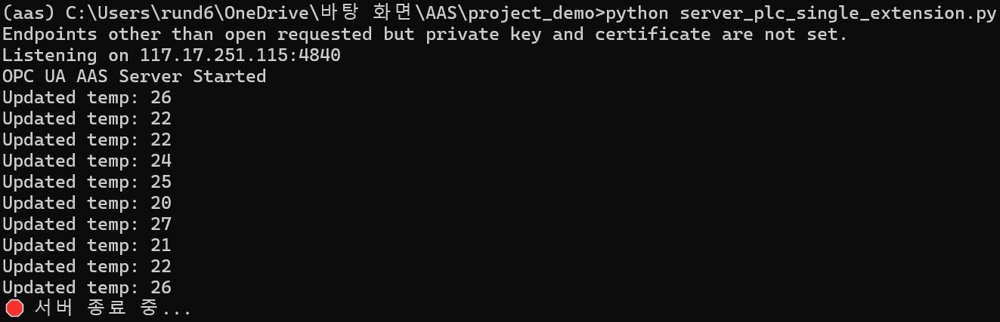
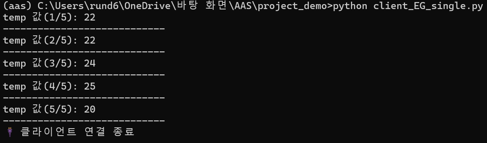

# AAS + OPC UA 기반 DT 데모 (Server_PLC → Client_EG)

이 프로젝트는 **OPC UA**를 이용하여 PLC 시뮬레이션 서버(Server_PLC)에서 엣지 게이트웨이(Client_EG)로 AAS 데이터를 전송하는 **디지털 트윈(Digital Twin)** 데모입니다.

---

## 구현 범위

- 현재 구현된 흐름:
PLC (시뮬레이션) → Server_PLC (OPC UA Server) → Client_EG (OPC UA Client)
- 연동할 PLC가 없어, Server에서의 간단한 상태변경으로 대체
- AAS 타입은 임의로 작성


> ✅ 향후 OPC UA Aggregation Server 및 Cloud Client 연동 예정

---

## 구성 요소 설명

### 1. AAS 구조 (`basyx-python` 기반 JSON)

```
AssetAdministrationShell (id: test1)
├── assetInformation
│   └── globalAssetId: "Test_BOT"
└── submodels
    ├── Identification
    ├── TechnicalData
    ├── OperationData
    │   └── temp (Property)
    │       ├── valueType: xs:int
    │       ├── value: 0 (초기값)
    │       └── semanticId: Properties/temp
    └── Documentation
```

### 2. OPC UA 서버 노드 구조

```
Objects
└── test1  (Object, AAS ID)
    ├── Identification   (Object, Submodel)
    ├── TechnicalData    (Object, Submodel)
    ├── OperationData    (Object, Submodel)
    │   └── temp         (Variable, Int32)
    │       ├── 초기값: 0
    │       └── 주기적 갱신 (random)
    └── Documentation    (Object, Submodel)
```

---

## 환경 설치

```bash
pip install opcua basyx-python-sdk
```

---


## 실행 방법

### 1. 서버 실행 (`server_plc_single_extension.py`)

- 위치: `project_demo/server_plc_single_extension.py`
- 동작:
  - AAS JSON 로드
  - OPC UA 노드 구성
  - `OperationData/temp`에 `random()`을 사용한 값 주기적 갱신

```bash
python server_plc_single_extension.py
```


### 2. 클라이언트 실행 (`client_EG_single.py`)

- 위치: `project_demo/client_EG_single.py`
- 동작:
  - Server_PLC로부터 `temp` 값을 5번 주기적으로 읽고 출력

```bash
python client_EG_single.py
```



## 구조 요약

```
project_demo/
│
├── writeAAS/
│   ├── AAS_test1.JSON           # AAS 모델 정의 (Identification, OperationData 등)
│   └── wrtie_test_AAS.ipynb     # AAS JSON 작성 노트북
│
├── client_EG_single.py          # OPC UA 클라이언트 (Edge Gateway 역할)
├── server_plc_single_extension.py  # OPC UA 서버 + AAS JSON 반영 + temp 갱신
└── README.md                    # 프로젝트 설명 문서
```


## 향후 계획

- [ ] OPC UA Aggregation Server 연동
- [ ] TSDB 저장 (ex. Machbase)
- [ ] 클라우드 모니터링용 OPC UA Client 구현

---

## 참고 자료

- [python-opcua 공식 문서](https://github.com/FreeOpcUa/python-opcua)
- [Eclipse BaSyx - AAS 모델링 툴](https://github.com/eclipse-basyx/basyx-python-sdk)